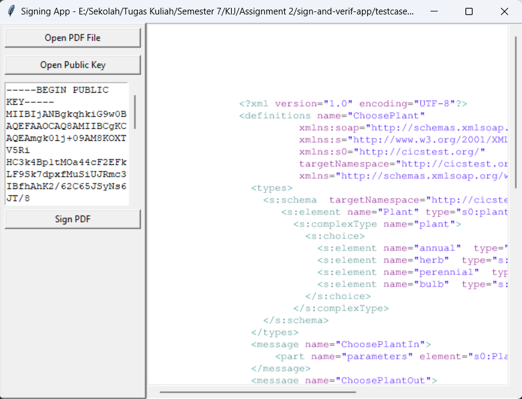
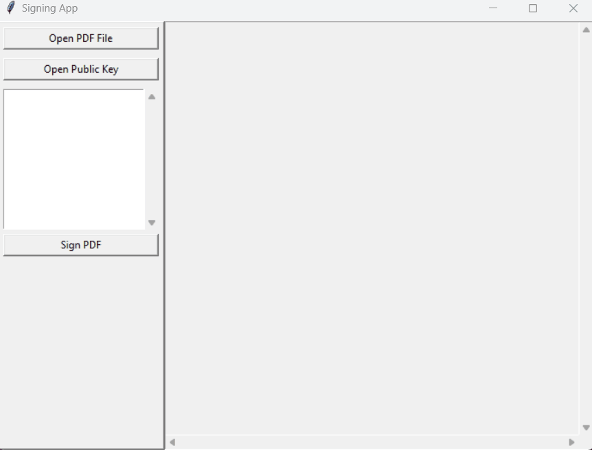
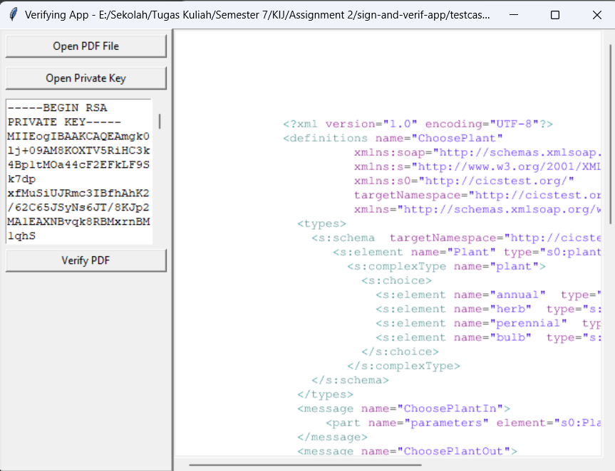
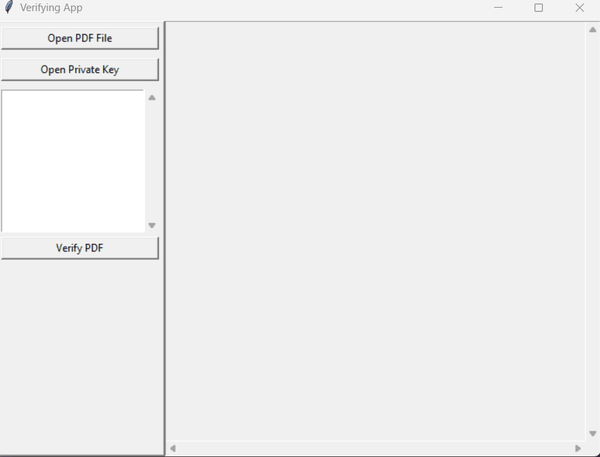

# Project Sign and Verification PDF

Created with :gift_heart: by Keluarga Kosimp

## Introduction
In this project we created 2 files which have different functions. The first program is to add a digital signature to a PDF file. The user can input the public key to the program to add the signature, but if the public key is not inputted into the program, the program will automatically generate the public key and private key for the user. The second program is checking the validation of a digital signature where the user is also required to input the private key.

## Project Overview

The image below is the interface of the first program. When starting the signing program, it just needs 3 steps to use this program. The features available are:
  1. Open the PDF file you want to sign
  2. Open the public key file (**optional**)
  3. Press **Sign PDF** and choose where you want to save the signed PDF



For make things easier, you can check this animation.



The image below is the interface of the second program. When starting the verifying program, it just needs 3 steps to use this program. The features available are:
  1. Open the PDF file you want to verify
  2. Open the private key file
  3. Press **Verify PDF**



For make things easier, you can check this animation.



## Collaborators

- [05111940000018 - Pramudya Tiandana Wisnu Gautama](https://github.com/wisnupramoedya)
- [05111940000062 - Thomas Felix Brilliant](https://github.com/ThomasFel)
- [05111940000096 - Stefanus Albert Kosim](https://github.com/yanzkosim)
- [05111940000175 - Muhammad Daffa](https://github.com/daffainfo)

## Requirements
- Python 3.9+

- Ghostscript 

Install [Ghostscript](https://ghostscript.com/releases/gsdnld.html) for running PDF on GUI.

## How to Use The Project

### How to Prepare

1. At very first initialization, create virtual env.

```
python -m venv venv
```

2. Activate virtual env.

```
./venv/Scripts/activate
```

3. Check where the Python refers to (run the code below). If it is in `{this_folder}/venv/Scripts`, then it should be correct.

```
python -c "import os, sys; print(os.path.dirname(sys.executable))"
```

4. Install the requirements needed.

```
pip install -r requirements.txt
```

5. If you want to create/update _requirements.txt_, use `freeze`.

```
pip3 freeze > requirements.txt
```

### How to Run

1. Activate virtual env.

```
./venv/Scripts/activate
```

2. Before running the program, if you don't have any pair key, run generator pair key.
```
python services/generate.py
```

3. Start the program after activate the virtual env.

```
# For signing
python signing.py

# For verification
python verifying.py
```

## Author's Note

This project is a part of Information and Network Security (C) 2022 course, Department of Informatics, ITS.
